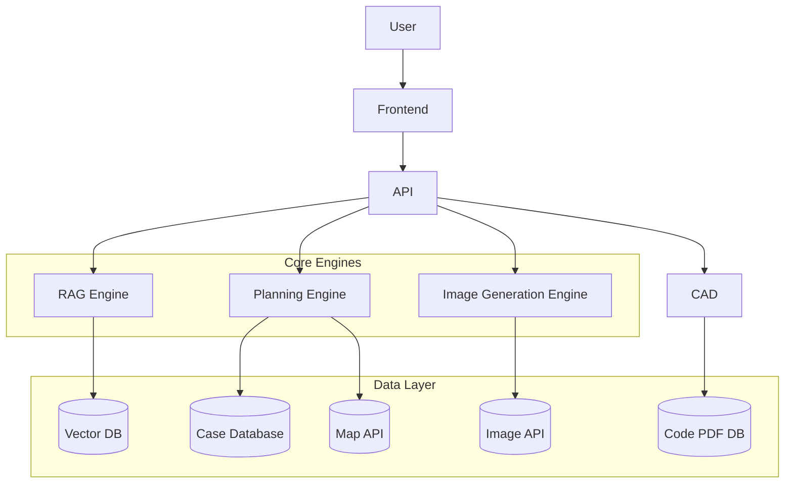

# 建筑设计策划智能助手系统  
**Architecture Design Planning AI Assistant**

Author: 殷晗陽  
Role: Product Design / System Architecture / Core Developer  

Keywords: LLM · RAG · OCR · PPT Generation · AWS · Docker · AI Agent

---

## 项目简介（Overview）

本项目是一个面向建筑设计前期策划阶段的智能辅助系统，融合大语言模型、多知识库检索、自动化内容生成与视觉生成技术，为用户提供从需求分析、方案构思到成果输出的一站式支持服务。

系统主要服务对象包括建筑设计师、建筑相关专业学生及策划人员，旨在降低方案策划门槛，提高设计效率与规范性。

> 核心目标：让非专业用户也能完成专业级建筑策划方案构建。

---

## 系统整体架构（System Architecture）


> 图1：系统整体架构示意图

整体系统采用“前端交互 + 中台调度 + 智能引擎 + 多源数据库”的分层架构设计。

主要组件包括：

- Web Frontend（交互界面）
- API Gateway（业务调度）
- LLM Service（大模型服务）
- RAG Engine（知识增强模块）
- OCR Service（图像解析模块）
- Storage Layer（多类型数据库）

---

## 🔹 功能模块一：多知识库智能问答系统（RAG-based Chat System）

### 功能说明

该模块基于 Gemini 大语言模型，结合 RAG 机制，实现面向建筑专业领域的精准问答服务。

接入的核心知识库包括：

- 建筑案例数据库（万级公共建筑案例）
- 建筑规范数据库（行业标准文档）
- 建筑设计知识文档库（团队整理经验库）

### 系统流程

```

User Query
↓
Intent Recognition
↓
Knowledge Retrieval
↓
RAG Fusion
↓
LLM Generation
↓
Final Answer

```

### 界面示例


> 图2：基于RAG的智能问答界面

### 技术要点

- 多知识库动态路由
- 语义意图分类
- 向量检索 + 文档重排
- 幻觉抑制机制设计

---

## 功能模块二：建筑策划方案生成系统（PPT Generator）

### 功能说明

该模块用于帮助用户从零开始构建完整建筑策划方案，并最终生成可编辑 PPT 成果。

核心理念：**交互引导 + 案例辅助 + 智能生成**

### 业务流程

1. 需求采集（对话引导）
2. 场地分析（地图API）
3. 案例匹配
4. 偏好选择
5. 大纲生成
6. 人工编辑
7. PPT自动生成

### 流程示意图


> 图3：策划生成流程示意图

### 编辑界面


> 图4：PPT在线编辑界面

### Prompt 设计思路

- 分层Prompt结构
- Page-level Prompt
- Role-based Prompt
- 约束型输出模板

---

## 功能模块三：建筑效果图生成系统（Image Generation）

### 功能说明

该模块基于多模型API接口，为用户生成符合需求的建筑效果图。

当前支持：

- NanoBana API
- [其他模型API]

未来方向：

- 建筑领域专用模型微调
- 多视角生成
- 结构一致性约束

### 示例结果


> 图5：建筑效果图生成示例

---

## 重点模块：CAD 建筑规范智能解析系统（独立开发）

### 背景

传统建筑规范查询依赖人工翻页，效率低且易出错。

本模块支持：

> 从 CAD 截图 → 自动定位规范页面 → 精准返回 PDF

### 系统流程

```

PDF Preprocess → OCR Indexing → Page Database
↑
CAD Screenshot → OCR + LLM → Code Extraction
↓
Page Matching
↓
PDF Return

```

### 界面示例


> 图6：CAD规范解析界面

### 核心技术

- PDF 批量OCR拆分
- 多策略文本识别融合
- 编号规则建模
- 高鲁棒索引结构
- API化服务设计

### 工程化实践

- Docker 容器化部署
- AWS EC2 云端运行
- RESTful API 集成
- 自动化日志监控

---

## 个人角色与贡献（My Contributions）

本人在项目中主要负责产品规划与系统架构设计，并承担多个核心模块研发工作。

### 主要职责

- 设计整体系统架构
- 规划产品交互流程
- 构建RAG问答体系
- 设计PPT生成流程
- 主导Prompt体系设计
- 独立开发CAD解析模块
- 完成云端部署与API设计

### 核心价值

- 将复杂建筑流程转化为可自动化系统
- 实现AI系统工程化落地
- 构建可扩展技术架构

---

## 🛠️ 技术栈（Tech Stack）

| 分类 | 技术 |
|------|------|
| LLM | Gemini |
| RAG | FAISS / Chroma |
| OCR | PaddleOCR / Custom |
| Backend | FastAPI |
| Frontend | React / Vue |
| Cloud | AWS EC2 |
| Deploy | Docker |
| DB | PostgreSQL / S3 / VectorDB |

---

## 🚧 技术难点与解决方案（Challenges）

### 1. RAG 精度不稳定

问题：检索结果噪声大  
方案：多阶段过滤 + rerank

### 2. OCR 误识别率高

问题：CAD文本复杂  
方案：OCR + LLM 校正融合

### 3. 用户需求表达不完整

问题：信息缺失  
方案：多轮引导式对话设计


## 🔮 后续规划（Future Work）

- 建筑专用生成模型训练
- 多模态协同设计
- BIM系统对接
- 企业级部署优化

---


