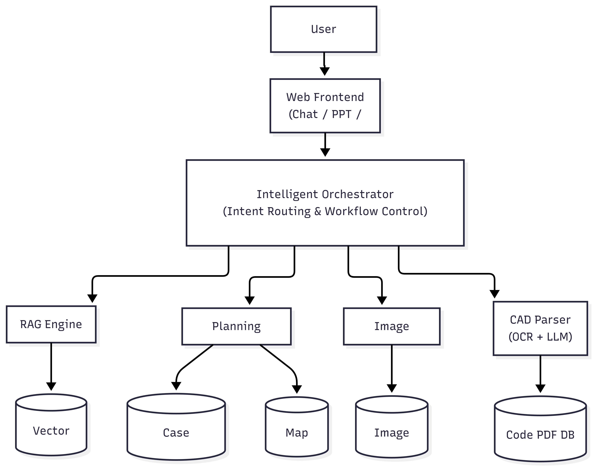
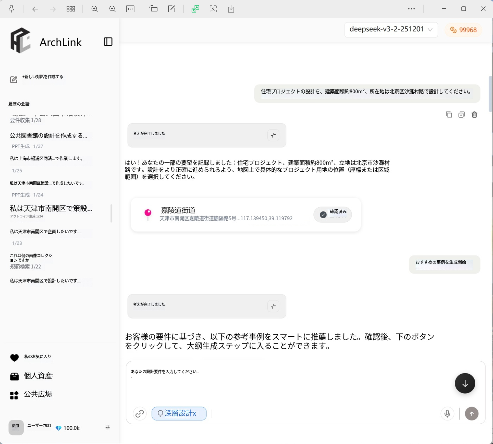
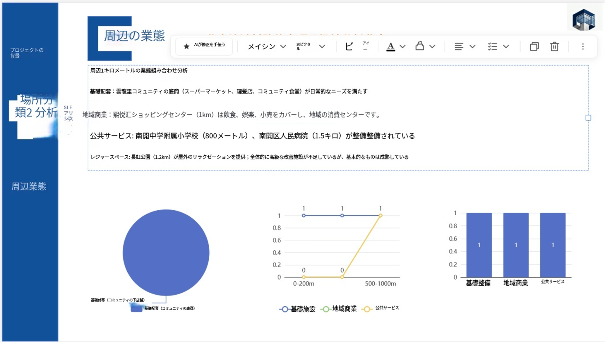
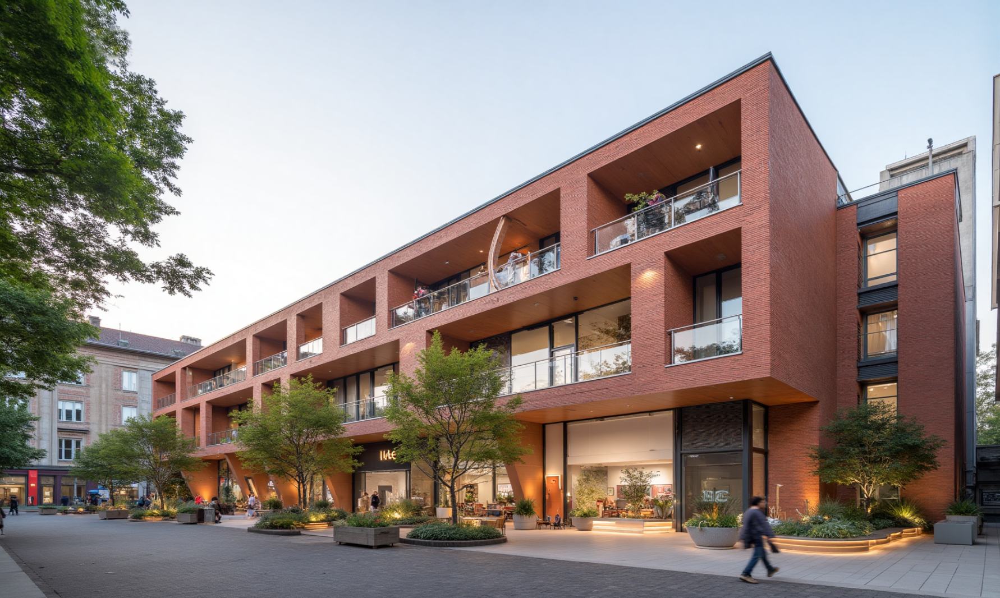

# 建築設計企画支援AIシステム  
**Architecture Design Planning AI Assistant**

Author: 殷晗陽  
Role: Product Design / System Architecture / Core Developer  

Keywords: LLM · RAG · OCR · PPT Generation · AWS · Docker · AI Agent

---

## プロジェクト概要（Overview）

本プロジェクトは、建築設計の企画初期段階を対象としたインテリジェント支援システムであり、大規模言語モデル、複数知識ベース検索、自動コンテンツ生成、画像生成技術を統合することで、要件整理から構想立案、成果物作成までを一貫して支援します。

主な利用対象は、建築設計者、建築系学生、企画担当者であり、企画業務のハードルを下げ、設計効率と専門性の向上を目的としています。

> 主要目標：非専門ユーザーでも専門レベルの建築企画案を構築できるようにすること。

---

## システム全体構成（System Architecture）



> 図1：システム全体構成図

本システムは、「フロントエンド + 中間制御層 + AIエンジン + 多種データベース」からなる階層型アーキテクチャを採用しています。

主な構成要素は以下の通りです。

- Web Frontend（ユーザーインターフェース）
- API Gateway（業務制御）
- LLM Service（大規模言語モデルサービス）
- RAG Engine（知識拡張モジュール）
- OCR Service（画像解析モジュール）
- Storage Layer（データ管理層）

---

## 🔹 機能モジュール1：多知識ベース統合型QAシステム（RAG-based Chat System）

### 機能概要

本モジュールは Gemini 大規模言語モデルと RAG 技術を組み合わせ、建築分野に特化した高精度な質疑応答機能を実現します。

接続されている主な知識ベースは以下の通りです。

- 建築設計事例データベース（公共建築中心・万件規模）
- 建築法規・規範データベース（業界標準文書）
- 建築設計知識データベース（チーム独自整理資料）

### システムフロー

```

User Query
↓
Intent Recognition
↓
Knowledge Retrieval
↓
RAG Fusion
↓
LLM Generation
↓
Final Answer

```

### 画面例



> 図2：RAG型QAシステム画面

### 技術的特徴

- 多知識ベース動的ルーティング
- 意図分類による検索制御
- ベクトル検索および文書再ランキング
- ハルシネーション抑制設計

---

## 🔹 機能モジュール2：建築企画案生成システム（PPT Generator）

### 機能概要

本モジュールは、ユーザーがゼロから建築企画案を構築し、最終的に編集可能な PPT 形式で出力することを目的としています。

基本コンセプト：**対話誘導 + 事例参照 + 自動生成**

### 業務フロー

1. 要件収集（対話型誘導）
2. 敷地分析（地図API連携）
3. 事例マッチング
4. 嗜好選択
5. 構成案生成
6. 手動編集
7. PPT自動生成

### フロー図


> 図3：企画生成フロー

### 編集画面



> 図4：PPT編集画面

### Prompt設計方針

- 階層型Prompt構造
- ページ単位Prompt設計
- ロールベース設計
- 制約付き出力テンプレート

---

## 🔹 機能モジュール3：建築パース自動生成システム（Image Generation）

### 機能概要

本モジュールは、複数の画像生成APIを統合し、ユーザー要望に応じた建築パースを自動生成します。

現在対応：

- NanoBana API
- [その他画像生成API]

今後の展開：

- 建築分野特化モデルの微調整
- マルチビュー生成
- 構造一貫性制御

### 生成例



> 図5：生成パース例

---

## 重点モジュール：CAD建築規範インテリジェント解析システム（個人開発）

### 背景

従来の建築規範検索は手作業によるページ探索が必要であり、作業効率および正確性に課題がありました。

本モジュールでは以下を実現しています。

> CADスクリーンショット → 規範ページ自動特定 → PDF即時取得

### システムフロー

```

PDF Preprocess → OCR Indexing → Page Database
↑
CAD Screenshot → OCR + LLM → Code Extraction
↓
Page Matching
↓
PDF Return

```

### 画面例


> 図6：CAD解析画面

### コア技術

- 建築規範PDFの一括OCR分割
- マルチ戦略文字認識融合
- 番号規則モデリング
- 高耐障害インデックス設計
- APIサービス化設計

### エンジニアリング実装

- Dockerによるコンテナ化
- AWS EC2でのクラウド運用
- RESTful API設計
- 自動ログ監視

---

## 担当役割と貢献（My Contributions）

本プロジェクトにおいて、主にプロダクト設計およびシステムアーキテクチャ設計を担当し、複数の中核機能の開発を担いました。

### 主な担当内容

- 全体アーキテクチャ設計
- UX／業務フロー設計
- RAG問答基盤構築
- PPT生成プロセス設計
- Prompt設計体系構築
- CAD解析モジュールの単独開発
- クラウド環境構築およびAPI設計

### 技術的価値

- 複雑な建築企画業務の自動化設計
- AIシステムの実運用レベルへの落とし込み
- 拡張性を考慮した基盤構築

---

## 技術スタック（Tech Stack）

| 分類 | 技術 |
|------|------|
| LLM | Gemini |
| RAG | FAISS / Chroma |
| OCR | PaddleOCR / Custom |
| Backend | FastAPI |
| Frontend | React / Vue |
| Cloud | AWS EC2 |
| Deploy | Docker |
| DB | PostgreSQL / S3 / VectorDB |

---

## 技術課題と解決策（Challenges）

### 1. RAG精度の不安定性

課題：検索ノイズが多い  
対策：多段フィルタリング＋再ランキング

### 2. OCR認識精度の低下

課題：CAD文字の複雑性  
対策：OCR＋LLM補正融合

### 3. 要件入力の不完全性

課題：情報欠損  
対策：多段対話誘導設計

---

## 今後の展開（Future Work）

- 建築特化生成モデルの開発
- マルチモーダル統合設計
- BIMシステム連携
- エンタープライズ対応強化

---
```
